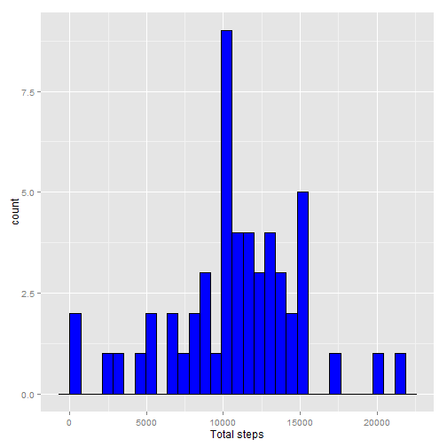
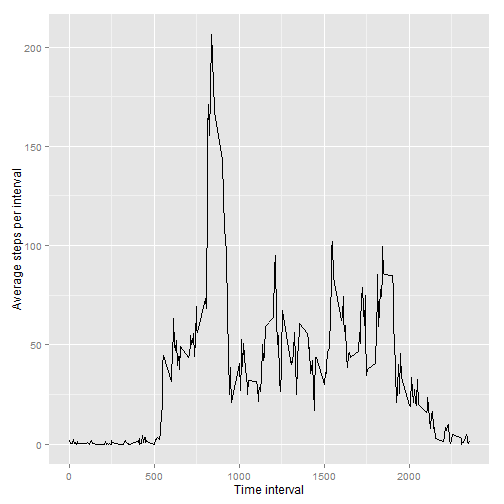
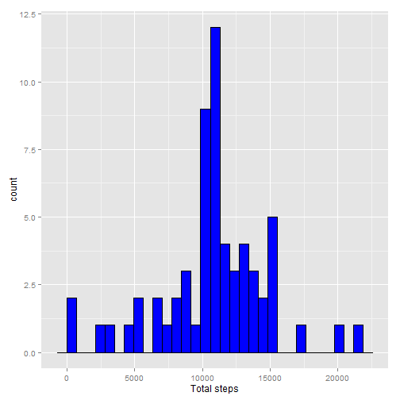
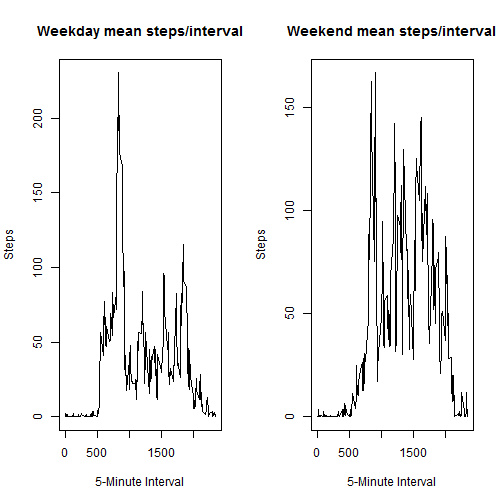

##1. Loading and preprocessing the data


```r
  library(ggplot2)
  act <- read.csv("activity.csv")
  summary(act)
```

```
##      steps                date          interval     
##  Min.   :  0.00   2012-10-01:  288   Min.   :   0.0  
##  1st Qu.:  0.00   2012-10-02:  288   1st Qu.: 588.8  
##  Median :  0.00   2012-10-03:  288   Median :1177.5  
##  Mean   : 37.38   2012-10-04:  288   Mean   :1177.5  
##  3rd Qu.: 12.00   2012-10-05:  288   3rd Qu.:1766.2  
##  Max.   :806.00   2012-10-06:  288   Max.   :2355.0  
##  NA's   :2304     (Other)   :15840
```

##2. What is mean total number of steps taken per day?


```r
  options("scipen" = 100)
  total_steps <- aggregate(steps ~ date, data = act, FUN = sum)
  mean_steps <- round(mean(total_steps$steps), 2)
  median_steps <- round(median(total_steps$steps), 2)
  qplot(total_steps$steps, xlab = "Total steps") + geom_histogram(colour="black", fill="blue")
```

```
## stat_bin: binwidth defaulted to range/30. Use 'binwidth = x' to adjust this.
## stat_bin: binwidth defaulted to range/30. Use 'binwidth = x' to adjust this.
```

 

###Mean steps per day: 10766.19.  Median steps per day: 10765.  


##3. What is the average daily activity pattern?  


```r
  options("scipen" = 100)
  interval_steps <- aggregate(steps ~ interval, data = act, FUN = mean)
  max_steps_per_interval <- round(max(interval_steps$steps), 2)
  interval_at_max <- interval_steps$interval[interval_steps$steps == max_steps_per_interval]
  ggplot(interval_steps, aes(interval, steps)) + geom_line() + labs(x = "Time interval", y = "Average steps per interval")
```

 

###Max steps per time interval = 206.17 occurs at time interval = .    


##4. Imputing missing values  


```r
  options("scipen" = 100)
  total_nas <- length(act$steps[is.na(act$steps)])
  #create copy of activity data frame and replase NA values with average value for 
  #the 5-minute interval we calculated
  act_corr <- data.frame(act)
  act_corr$steps <- ifelse(is.na(act_corr$steps), interval_steps$steps[match(act_corr$interval,interval_steps$interval)], act_corr$steps)

  total_steps_corrected <- aggregate(steps ~ date, data = act_corr, FUN = sum)
  mean_steps_corrected <- round(mean(total_steps_corrected$steps), 2)
  median_steps_corrected <- round(median(total_steps_corrected$steps), 2)
  qplot(total_steps_corrected$steps, xlab = "Total steps") + geom_histogram(colour="black", fill="blue")
```

```
## stat_bin: binwidth defaulted to range/30. Use 'binwidth = x' to adjust this.
## stat_bin: binwidth defaulted to range/30. Use 'binwidth = x' to adjust this.
```

 

###Total number of existing NA records with NA for steps: 2304.    
###After correcting records with NA steps:
###Mean steps per day: 10766.19.  Median steps per day: 10766.19.  


##5. Are there differences in activity patterns between weekdays and weekends?  

```r
act_corr$day_type <- factor(ifelse(weekdays(as.Date(act_corr$date)) %in% c("Saturday", "Sunday"), "weekend", "weekday"))
ac_split <- split(act_corr, act_corr$day_type)
mean_steps_weekday <- aggregate(steps ~ interval, data = ac_split$weekday, FUN = mean)
mean_steps_weekend <- aggregate(steps ~ interval, data = ac_split$weekend, FUN = mean)

  par(mfrow = c(1,2))  #create 1x2 grid
  
  plot(mean_steps_weekday$interval, mean_steps_weekday$steps, type = "l"
       , ylab = "Steps"
       , xlab = "5-Minute Interval"
       , main = "Weekday mean steps/interval"
  )
  
  plot(mean_steps_weekend$interval, mean_steps_weekend$steps, type = "l"
       , ylab = "Steps"
       , xlab = "5-Minute Interval"
       , main = "Weekend mean steps/interval"

         )
```

 


